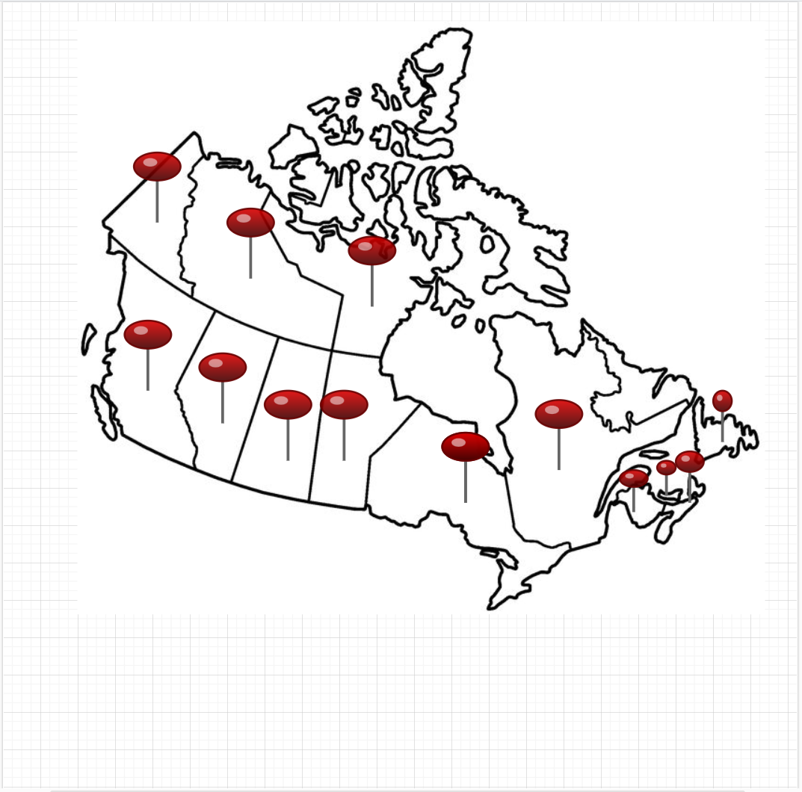
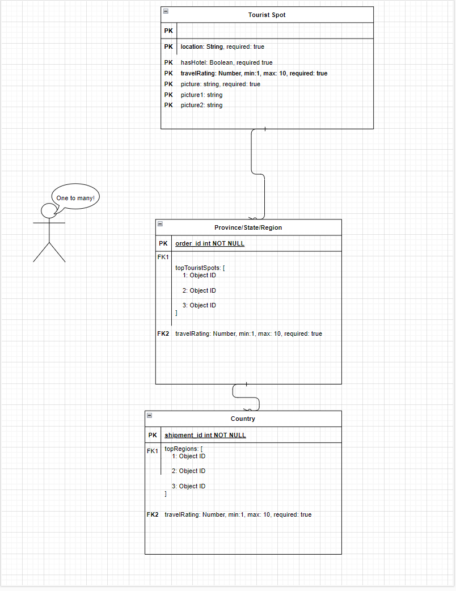
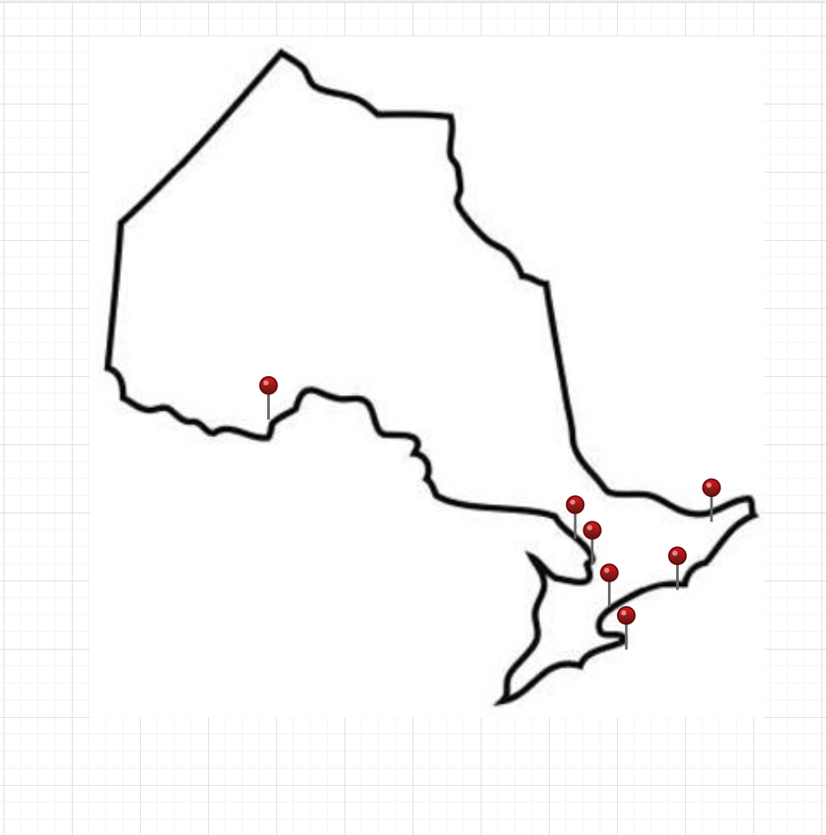
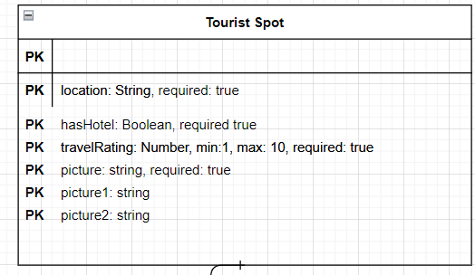
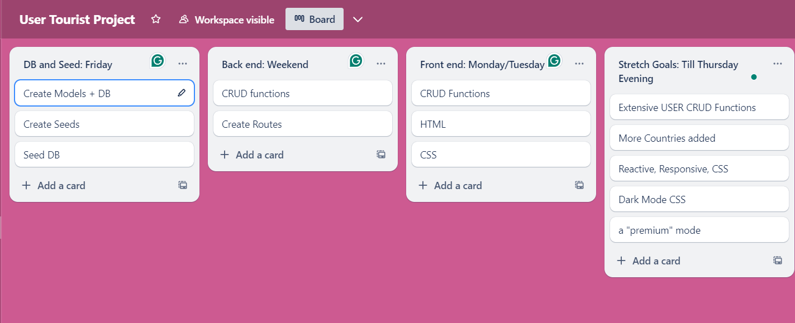

# User Tourist Guide
### Letting the tourists make the guide since 2024

The goal of this project is to let users use CRUD to make their own tourism guides for their own countries and for countries they visit.  They can create a *tourist spot* and then other users can vote on it. The end result is a list of the best tourist spots in a country or region voted by the users.

# ERD:

With tourist spots as the parent, I can reference it with region and country children. This way you can **click** on Canada, see a list of provinces, **click** on a province, and then that province will list the top *tourist spots*. See the images below for an example.

# Wireframes/User Story:

Rundown for a user:

1. Select Country, after selecting a screen like what is below will pop up. In this example, the user selected Canada.

2. Select a province. The user selected Ontario.

3. After selecting Ontario, the map changes to a map of Ontario, where users can now select tourist spots.

4. User selects a spot:

5. User would see a rating of the spot, along with pictures and whether or not it has available hotels. 

6. After visiting the location, the users can then give the location a score.

# MVP and Stretch Goals

### MVP:

The MVP would be just focused on Canada. The only CRUD on the front end would be that users can create and update reviews for tourist spots, but not create their own tourist spots.

### Stretch Goals:

Stretch Goals would be multiple countries, and users can create their own tourist spots, and then if a tourist spot has a poor rating, that spot can be deleted.

## Trello Board:

## Fun Errors Along the Way: 

- TypeError: Invalid schema configuration: `true` is not a valid type at path `required`

    - I wrote ` Type: String`, instead of `type: string`

- TypeError: Schema is not a constructor

    - At the top of my models/spot.js file, I forgot to enclose my `Schema` in brackets like so `{ Schema }`
    

# Credit:

Created by Gideon Cove
